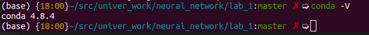
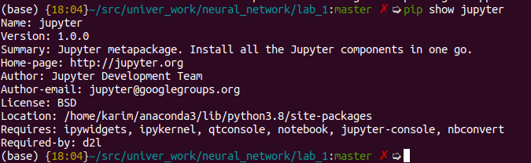
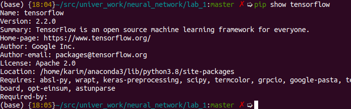

## This readme has report of first lab of `Introduction into artificial neural networks. Preliminaries. Linear Neural Networks`
---
### Installation

0. Installing conda and jupyter notebook   

0. jupyter version  

0. tensorflow version  

---
### Dataset information
I used dataset that was download on [kaggle website](https://www.kaggle.com/dansbecker/melbourne-housing-snapshot)

A [dataset](./melb_data.csv) is Melbourne housing data. The **goal** is to **predict** price of house   
The dataset includes Address, Type of Real estate, Suburb, Method of Selling, Rooms, Price, Real Estate Agent, Date of Sale and distance from C.B.D.  

Check [jupyter's type file](.lab_1_dataset_description.ipynb) for look at details of dataset's description :green_book:

